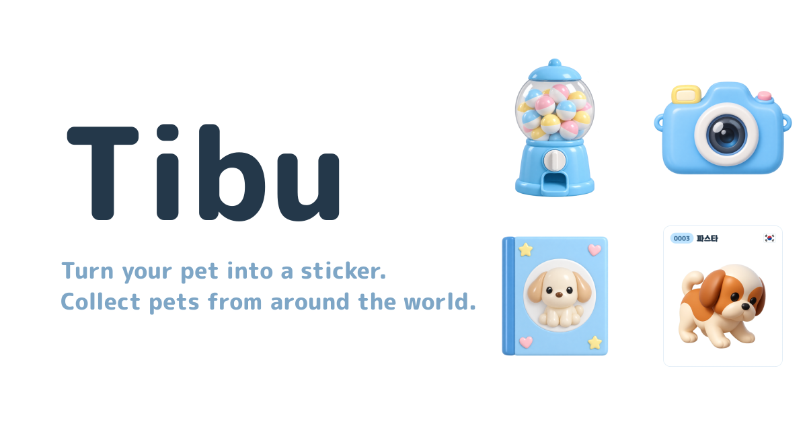

# tibu

Turn a photo of your pet into a collectible sticker, then draw stickers of other pets from around the world.

**Try it: https://tibu-sand.vercel.app**

[](https://tibu-sand.vercel.app)

## How it works

1. **Make** – upload a pet photo, crop it to a square, and an AI model redraws it in three styles (Realistic, 3D, 2D). Pick one, give it a name, a country flag and a short speech bubble.
2. **Draw** – turn the gacha machine to get a random sticker made by someone else. Every sticker has the same chance. The speech bubble is a message from the pet's owner to whoever draws it.
3. **Collect** – everything you make or draw is kept in your album, and any sticker can be saved as an image.

Each sticker gets a permanent serial number, starting from `0000`.

## Rules

| | |
| --- | --- |
| Making | 3 photo conversions per day |
| Drawing | 3 draws per day, plus 1 for each sticker you finish that day |
| Day reset | Midnight in your own time zone |
| Reports | A sticker you drew can be reported. Staff review every report by hand. If upheld, the sticker is removed, its maker is told, and each reporter gets a bonus draw |
| Account deletion | Erases your album and activity. Stickers you made stay in the pool, no longer linked to you |

## Tech

- [Next.js](https://nextjs.org) (App Router, TypeScript), deployed on [Vercel](https://vercel.com)
- [Supabase](https://supabase.com) for Google sign-in, Postgres and image storage
- [OpenAI](https://platform.openai.com) image model for the photo-to-sticker conversion
- Mobile-only layout, English-only interface, no UI framework (plain CSS; the 3D-look illustrations are generated images)

## Run it locally

```bash
npm install
npm run dev
```

Open http://localhost:3000 at phone width.

With no keys configured the app starts in **demo mode**: a fake sign-in, data kept in a local `.demo-data/` folder, five sample stickers to draw, and no AI conversion (your photo is passed through unchanged). This is enough to try every screen.

## Run it for real

1. Create a Supabase project and run [`supabase/schema.sql`](supabase/schema.sql) in the SQL editor.
2. Enable the Google provider in Supabase Auth, using an OAuth client from Google Cloud whose redirect URI is `https://<project>.supabase.co/auth/v1/callback`.
3. In Supabase Auth → URL Configuration, set the site URL and add `<your-site>/auth/callback` as a redirect URL.
4. Copy `.env.example` to `.env.local` and fill it in:

| Variable | What it is |
| --- | --- |
| `NEXT_PUBLIC_SUPABASE_URL` | Supabase project URL |
| `NEXT_PUBLIC_SUPABASE_ANON_KEY` | Supabase `anon` key |
| `SUPABASE_SERVICE_ROLE_KEY` | Supabase `service_role` key (server only, keep it secret) |
| `OPENAI_API_KEY` | OpenAI API key with credit on the account |
| `OPENAI_IMAGE_MODEL` | Optional. Defaults to `gpt-image-2.5-sunburst` |
| `STAFF_EMAILS` | Optional. Extra Google accounts allowed into `/staff`, comma-separated |

Set the same variables in Vercel. `vercel.json` pins server functions to Sydney (`syd1`) to sit next to the database; change it if your Supabase project is in another region.

## Project layout

```
src/app            pages (/, /create, /draw, /album, /staff, /terms, /privacy) and API routes
src/components     sticker card, crop tool, shared UI
src/lib            shared types, sticker image rendering, client helpers
src/lib/server     auth, daily limits, reports, OpenAI call, data stores
supabase           database schema
public/art         home screen illustrations
public/seed        sample pets used in demo mode
public/flags       country flags (from flag-icons, MIT)
```

`src/lib/server/store.ts` defines the storage interface. It has two implementations: `store-supabase.ts` for production and `store-demo.ts` for demo mode.
